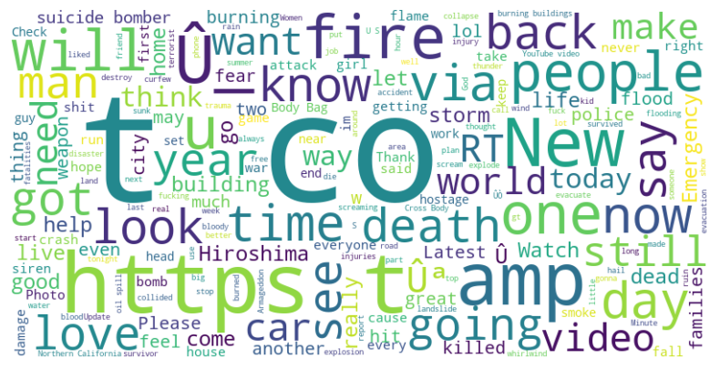

# Predicting Disaster Tweets using Bag of Words
A web app which predicts whether a given tweet is about a real disaster or not using Bag of Words - A beginner's approach to NLP.

You can view the live demo [here](https://oyebamiji-micheal-predicting-disaster-tweets-using-bag-of-words.streamlit.app).

 

## About the Project

This project is focused on predicting whether a given tweet is related to a real disaster or not. The objective is to utilize NLP techniques to process and analyze the textual content of tweets and create a predictive model that can accurately classify tweets as disaster-related or not. The dataset was gotten from a Kaggle competition, <a href="https://www.kaggle.com/competitions/nlp-getting-started/">NLP Getting Started - Disaster Tweet Prediction</a>.

My main goal is to familiarize myself with fundamental NLP concepts, including tokenization, lemmatization, stop words, stemming, and the bag of words model. In addition, I aim to gain hands-on experience in applying NLP techniques to real-world text data and understanding their impact on model performance.

 

